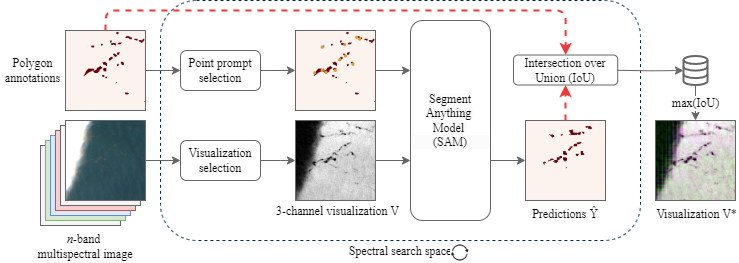

# SAMSelect: An Automated Spectral Index Search using Segment Anything

<!-- let's add those when they are ready
[[`paper`](google.com)][[`demo`](google.com)][[`dataset`](google.com)]
-->

> SAMSelect discovers three-channel visualizations from multispectral imagery where pre-specified objects are most visible. It builds on Meta's [Segment Anything Model (SAM)](https://segment-anything.com/) to rank band combinations based on segmentation accuracy in the 3-channel visualization. 



## Getting Started

```
# install samselect and its dependencies
pip install git+ssh://git@github.com/geoJoost/SAMSelect.git

# Setup the environment
python setup_environment.py

# Activate conda environment
conda activate samselect

# If GPU is available, install Pytorch dependencies
conda install pytorch=2.4.1 torchvision=0.17.2 torchaudio=2.2.2 pytorch-cuda=12.4 -c pytorch -c nvidia

# Install other dependencies
pip install -e .

# Run samselect on the demo data (available from Google Drive at https://drive.google.com/drive/folders/1UBy1mnVWgmaF_1nKgGyrYtS_L52mACIy?usp=sharing), store into SAMSelect/data/
samselect --image data/demo_durban_20190424.tif --annotations data/demo_durban_20190424.shp

# please check for more instructions on usage
samselect --help 
```

To run SAMSelect on your own data, you can modify [this Google Earth Engine script](https://code.earthengine.google.com/b31594853f8b1752f7fcf79883062bf3) to 
1. download a Sentinel-2 image
2. annotate some of the objects that you would like to visualize better
3. download them to your Google drive (click "run" in "Tasks" tab)

## Example Visualizations


## Dataset Requirements
We require the following data to initiate SAMSelect:

1. **Sentinel-2 scene**: SAMSelect is designed with Sentinel-2 data in mind, specifically with Sen2Cor's L2A product. Other products (i.e., from ACOLITE or TOA) can be used with modifications to the `band_list` argument (see settings below).
2. **Polygon annotations**: Provide a shapefile with polygon annotations for the objects-of-interest. In case objects are larger than the patch size (1280m/128px), please change the `patch_size` argument in `scripts/dataloader`.

### `samselect` Function Arguments

1. **`image`** (`str`):
    - **Description**: The path to the Sentinel-2 scene (TIFF).
    - **Example**: `'data/demo_durban_20190424.tif'`

2. **`annotations`** (`str`):
    - **Description**: The path to the shapefile with polygon annotations.
    - **Example**: `'data/demo_durban_20190424.shp'`

3. **`bands`** (`list of str`):
    - **Description**: List of Sentinel-2 bands available within the TIFF. Default is L2A bands, but Sen2Cor (L1C, L2A) and ACOLITE (L1R, L2R) are supported.
    - **Example**: `['B1', 'B2', 'B3', 'B4', 'B5', 'B6', 'B7', 'B8', 'B8A', 'B9', 'B11', 'B12']`
    - **Default**: `['B1', 'B2', 'B3', 'B4', 'B5', 'B6', 'B7', 'B8', 'B8A', 'B9', 'B11', 'B12']`

4. **`narrow_search_bands`** (`list of str, optional`):
    - **Description**: Manual selection of bands for narrow spectral search. Define as a list like `[B1, B2, B3, B4]`. An exhaustive search is run using `None`.
    - **Example**: `['B2', 'B3', 'B4', 'B8', 'B8A']`
    - **Default**: `None`

5. **`scaling`** (`str`):
    - **Description**: Normalization function to arrange DN into RGB range (0-255).
    - **Example**: `'percentile_1-99'`
    - **Default**: `'percentile_1-99'`

6. **`equations`** (`list of str`):
    - **Description**: Visualization modules. Options include:
        - **`bc`**: Band Composites (BC)
        - **`ndi`**: Normalized Difference Indices (NDI)
        - **`ssi`**: Spectral Shape Indices (SSI)
        - **`sic`**: Spectral Index Composite (SIC)
    - **Example**: `['ndi', 'ssi']`
    - **Default**: `['bc', 'ndi', 'ssi', 'sic']`

7. **`model_type`** (`str`):
    - **Description**: SAM encoder type.
    - **Example**: `'vit_b'`
    - **Default**: `'vit_b'`


Additional notes:
- Depending on the hardware (GPU/CPU), the number of spectral bands, and the number of images, processing time can vary from one hour to several. As a rule of thumb, processing of each visualization takes about 10 seconds using a GPU and 64-74 seconds using a CPU.
- If a previous SAMSelect output exists for the same configuration, the system will skip computation and directly move to generating tables and graphs from the cached data, reducing runtime significantly.

## Comparison Methods
In addition to SAMSelect's visualizations, three other methods are used for comparison purposes:
1. Floating Debris Index ([Biermann et al., 2020](https://www.nature.com/articles/s41598-020-62298-z))
2. Normalized Difference Vegetation Index (NDVI)
3. Principal component analysis (PCA).

Important note:
If using data from different sensors, you may need to adjust the associated functions in `spectral_indices.py`, as certain indices (e.g., NDVI) are hard-coded to specific band combinations, such as `['B4', 'B8']` for Sentinel-2. Ensure the correct bands are selected for your sensor type.
